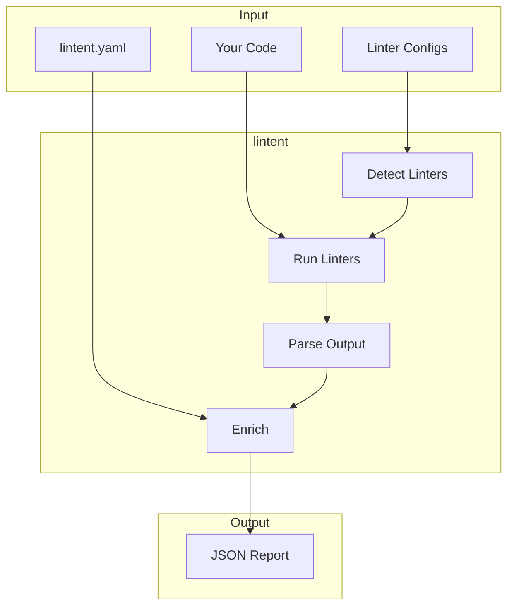

# How It Works

lintent is a thin orchestration layer that runs your existing linters and enriches their output with semantic meaning.

## Architecture



## The Flow

### 1. Detection

lintent scans your project for linter configuration files:

| File Found | Linter Enabled |
|------------|----------------|
| `pyproject.toml` with `[tool.ruff]` | ruff |
| `pyrightconfig.json` or `[tool.pyright]` | pyright |
| `eslint.config.js` or `.eslintrc.*` | eslint |
| `tsconfig.json` | typescript |

No configuration needed - lintent uses your existing setup.

### 2. Execution

Each detected linter runs with JSON output:

```bash
# What lintent runs internally
ruff check . --output-format json
pyright --outputjson
eslint . --format json
tsc --noEmit --pretty false
```

### 3. Parsing

Each linter has different JSON formats. lintent normalizes them:

```typescript
interface LinterViolation {
  file: string;
  line: number;
  column: number;
  tool: string;
  code: string;
  message: string;
}
```

### 4. Enrichment

For each violation, lintent looks up the rule in `lintent.yaml`:

```yaml
rules:
  ruff:
    F401:
      illegal: "Importing modules that are not used"
      legal: "Only import what you use"
      why: "Clean dependency graph"
```

The lookup key is `{tool}/{code}` (e.g., `ruff/F401`).

### 5. Output

The final report includes everything:

```json
{
  "violations": [...],
  "linters": {
    "detected": ["ruff", "pyright"],
    "results": [...]
  },
  "summary": {...}
}
```

## What lintent Does NOT Do

- **Replace your linters** - It runs them, doesn't reimplement them
- **Fix code** - It reports violations, fixing is up to you (or your AI agent)
- **Configure linters** - You maintain your existing linter configs
- **Require specific linters** - Use whatever you already have

## Performance

lintent adds minimal overhead:

- Linters run in parallel
- JSON parsing is fast
- Enrichment is O(1) lookup
- Typical overhead: <500ms

## Error Handling

When things go wrong, lintent provides context:

```json
{
  "linters": {
    "results": [
      {
        "name": "ruff",
        "status": "not_found",
        "error": "'ruff' is not installed. Install it with: pip install ruff"
      }
    ]
  }
}
```

Linter failures don't crash lintent - you get partial results from working linters.
